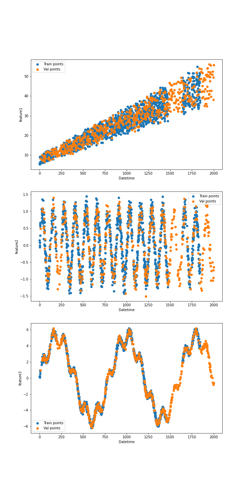

## data-analysis-sklearn

## Description

This repository contains source code of Estimated Data Analysis of practical tasks, given as an assignment in my
university.

## How it could help other people

In this repository I used best-practises with working with sklearn (line Pipelines, data imputations) and data
visualization.

## How to run code

1. Make sure that you have installer python and pip (check it via running in console `python --version`)
2. Install requirements by running in terminal: `pip install -r requirements.txt`
3. Run in terminal: `jupyter-notebook`.
4. Go to website, printed in console, go to folder jupyter-notebook and run .ipynb

## Collection of jupyter notebooks

- `achieving-97-val-acc-on-mnist.ipynb` - getting 97% validation accuracy using dense model.
- `training-mnistautoencoder.ipynb` - training an auto encoder on mnist with dim of latent space = 2 and visualizing it.
   *Visualization of work of morphs of features embeddings*
- `data-inputing-predicting.ipynb` - described in task 1 section.
- `loans-approval.ipynb` - described in task 2 section.

## Task 1

Given as an input a datetime column, you need to make 3 models to predict each feature (1, 2, 3).

*This is example of training data (data is already encoded with OrdinalEncoder from sklearn)*

|    |   datetime |   feature1 |   feature2 |   feature3 |
|---:|-----------:|-----------:|-----------:|-----------:|
|  0 |        967 |    25.6189 |  -0.932839 |   3.90016  |
|  1 |        836 |    28.5598 |  -1.17187  |   0.223089 |
|  2 |       1168 |    31.3903 |   0.82609  |   2.06954  |
|  3 |        344 |    14.2057 |  -0.921493 |   1.2074   |
|  4 |        939 |    25.0476 |   0.294643 |   4.73171  |

For each feature I tried only Linear models with different PolynomialsFeatures.
Visualization of train/test data and visualization of best model predictions are lister below.

| Train/test data visualization  | Predictions visualization |
| ------------- | ------------- |
|   |   |

## Task 2 

To be added.